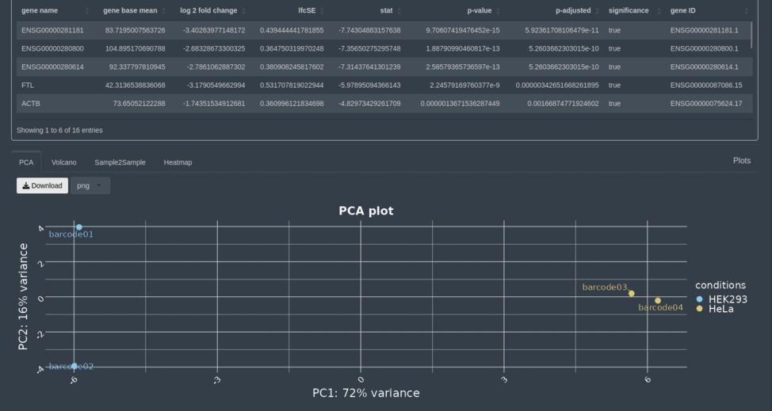

NanopoReaTA - Nanopore Real Time Analysis Pipeline
==================================================


[](https://www.nextflow.io/)
[](https://www.r-project.org/)
[](https://shiny.rstudio.com/)

**NanopoReaTA** is an R shiny application that integrates both preprocessing and downstream analysis pipelines for RNA sequencing data from Oxford Nanopore Technologies (ONT) into a user-friendly interface. NanopoReaTA focuses on the analysis of cDNA and direct RNA-sequencing (cDNA, DRS) reads and guides you through the different steps up to final visualizations of results from i.e. differential expression or gene body coverage. Furthermore, NanopoReaTa can be run in real-time right after starting a run via MinKNOW, the sequencing application of ONT. 


**Currently available analysis modules:**
1. [Run Overview](#run-overview) - Experiment statistics over time
2. [Gene-wise analysis](#gene-wise-analysis) - Gene-wise analysis of expression (Gene counts, Gene body coverage)
3. [Differential expression analysis](#differential-expression-analysis) - Differential expression and/or usage analysis of genes (DEA) and transcripts (DTE + DTU)

## Install
### Requirements
 Hardware |
 :---: 
RAM: 64GB |
Threads: > 12 

 Software | 
 :---: 
Linux based operating system |
Anaconda | 
python >= 3.8 |
R >= 4.1.2 |
python packages (provided via conda environment) |
R packages (installation is automatized via R shiny) 

R can be installed from CRAN (https://cran.r-project.org/). Anaconda can be downloaded with the follwing steps:

```bash
cd ~
wget https://repo.anaconda.com/archive/Anaconda3-2022.05-Linux-x86_64.sh
bash ~/Anaconda3-2022.05-Linux-x86_64.sh
source ~/.bashrc
```

### Installation steps
#### Create a conda enviroment and install packages from requirements_NanopoReaTA.yml by following the steps below (~ 6 min):
```bash
git clone git@github.com:AnWiercze/NanopoReaTA.git
conda env create -f /path/to/NanopoReaTA/app/requirements_nanoporeata.yml
```

#### Activate the conda environment 
```bash
conda activate nanoporeata
```

#### The following libraries are required and needs to be installed first:
```bash
conda install -c conda-forge r-devtools
conda install -c conda-forge cxx-compiler
conda install -c anaconda cmake
```

## Start NanopoReaTA
NanopoReaTA will be started executing the following command within the conda environment: 

```bash
conda activate nanoporeata
cd /path/to/NanopoReaTA/app
Rscript app.R
```

All R packages that have not been installed yet will be downloaded and installed into your conda environment automatically, when starting NanopoReaTA the first time. This can take up to ~ 30 min. After the installation of packages is finished, **a browser link** will appear. Copy and paste the link shown in your terminal into a browser window, in case the app does not open automatically.  


## Usage
Before running/exploiting real experiments with NanopoReaTA, we highly recommend to test the app, first (see [Testing](#testing) for more information). NanopoReaTA operates with a backend preprocessing pipeline based on [nextflow](https://www.nextflow.io/) and multiple R and python based scripts for downstream analyses. All results are visualized within the [R shiny](https://shiny.rstudio.com/) based frontend.

### Welcome Page
When the application is started, the welcome page is shown and contains a **Start NanopoReaTA** button as well as the [NanopoReaTA](#nanoporeata---nanopore-real-time-analysis-pipeline) manual. 

### Configuration Page 
After pushing the **Start NanopoReaTA** button, the configuration page opens and the user has to fill out required information or upload an already existing configuration file in yaml format from previous NanopoReaTA runs (Please check [example_conf_files](example_conf_files) for correct parameter naming). After all configurations are set, the configurations will be saved as config.yaml in the defined output folder.  

The following parameters have to be set by the user: 
*Directory inputs needs an "/" at the end. Please make sure to let them end with an "/" character. 

 Parameter | Datatype | Comments 
 :---: | :---: | :---:
 Number of threads | integer | Can be adjusted on the interactive scale bar 
 Run preprocessing | bool | Select yes or no (Yes if you want to run the nxtflow pipeline, no if your data is already preprocessed)
 Barcoded | bool | Select yes or no (Yes if your dataset is multiplexed, no if it is not multiplexed)
 Path to main directory | string | Please insert the experiment directory created by MinKnow when the sequencing is started; Do not forget the "/" at the end of the directory path
 Path to a metadata/description file  | string | Please insert the filepath to the created metadata file
 Path to Reference genome file  | string | Please insert the filepath to the reference genome
 Path to Reference transcriptome file  | string | Please insert the filepath to the reference transcriptome
 GTF annotation file  | string | Please insert the filepath to the GTF file
 BED annotation file | string | Please insert the filepath to the BED file
 Output directory | string | Please insert the output directory file (Note that the ouput directory should already exist as an empty instance)
 
 #### Example metadata file
 The metadata file has to be created manually using tab separation (.tsv) and must contain at least three columns of the following structure: "Samples", "Condition", "Experiment", "Custom1", "...".
 
 Samples | Condition | Experiment | Custom 
 :---: | :---: | :---: | :---: 
 Sample1 | Cond1 | E1 | male
 Sample2 | Cond2 | E1 | female
 Sample3 | Cond1 | E1 | female
 Sample4 | Cond2 | E1 | male
 
 #### Reference and annotation files
The required genome and annotation files for the organism of interest must be downloaded from the Gencode database (https://www.gencodegenes.org/), since the syntax of NanopoReaTA is suited to the respective standards. Mouse reference data can be obtained at GENCODE database: GRCm39 Release M27 (https://www.gencodegenes.org/mouse/release_M27.html). Human reference data can be obtained at GENCODE database: GRCh38.p13 v40 (https://www.gencodegenes.org/human/release_40.html). BED files of the respective genome versions can be downloaded from RSeQC: (https://sourceforge.net/projects/rseqc/files/BED).

The following files need to be downloaded:

 Functionality | Datatype | Comments 
 :---: | :---: | :---:
 Reference Genome | .fastq | Use primary assembly 
 Reference Transcriptome | .fastq | Use cdna files 
 GTF file | .gtf | Use the version that fits reference genome and transcriptome 
 BED file | .bed | BED files are available on (https://sourceforge.net/projects/rseqc/files/BED) 

The selection can be confirmed by clicking the button at the bottom right of the tab **=>**. 

#### Sample settings
In this tab the metadata file is shown and the user can check whether all information are loaded correctly. For pairwise comparison, the user needs to select one of the columns containing two conditions that will be compared in further analyses. For visualizations, the user can change the color-coding for each condition here.  

By clicking on **Settings overview**, the user will be forwarded to the final [configuration overview](#settings-overview).
 
#### Settings overview
The input configurations can be finally checked by the user. If the paramters are correct, the user can start the preprocessing by clicking the **Start preprocessing** button. Otherwise the user can rearrange the settings by going back to the configuration tab

#### NanopoReaTA run options
There are three options how and if to run preprocessing of NanopoReaTA: 
1) Start  [NanopoReaTA's UI](#start-nanoporeata) and select *Run Preprocessing - Yes* at the [Configuration Page](#configuration-page) to start the backend preprocessing pipeline within the app. The user can keep track of the running nextflow pipeline within the index.log and error.log files created in the user-defined output folder by executing `tail -f /path/to/output/dir/index.log` in a terminal window. 
2) For visualization of NanopoReaTA preprocessed results only, start [NanopoReaTA's UI](#start-nanoporeata), select *Preprocessing - No* and set the respective output folder created by NanopoReaTA at the [Configuration Page](#configuration-page), before pressing the "Start Preprocessing" button. Preprocessing will not be executed.
3) Start preprocessing pipeline outside NanopoReaTA's UI by selecting *Preprocessing - No* at [Configuration Page](#configuration-page) before pressing the "Start preprocessing" button. In this case, preprocessing will not be executed automatically. The configuration file that is saved as config.yaml in the user-defined output folder will be used to start the nextflow pipeline in parallel by executing the following commands in a second terminal:
```
conda activate nanoporeata
cd /path_to_app/NanopoReaTA/app/server/scripts_nextflow/ 
nextflow run new_np_pipe.nf -params-file /path_to_output_dir/defined_in_UI/config.yaml
```
The pipeline will start to run and create a constantly updated text output on the console. The running pipeline can now be constantly observed. 

*Adavantages of starting Preprocessing outside the UI:
This approach has a couple of benefits, when running a long sequencing experiment. Such that the processing pipeline will not be closed in case someone is closing the browser window. Additionally, one can keep track of the steps executed in the nextflow pipeline directly within the terminal.*

### Run Overview
The Run Overview tab shows the number of reads and feature counts and visualizes the sample- and group-wise read length distribution and gene expression variability per preprocessing iteration. Additionally, the time each tool needs in each iteration is shown. All information is constantly updating when preprocessing is running.

#### Number of observations
The table in this tab shows the number of mapped genes (minimap2), gene counts (featureCounts) and transcriptome (salmon) counts. The counts are provided for each sample, respectively. 

#### Read length distribution 
One can see the read length distributions for respective samples or selected conditions. The read length information is extracted directly from the fastq files (passed_reads).

#### Gene expression variability

On the left side the number of genes detected is plotted per iteration for samples and selected conditions respectively. The information is extracted from the output count table of feature counts. 

On the right side the deviation of relative gene abundancy compared to the last iteration is plotted. This is a measure for the change of gene abundancy variability within a single sample. The latter allows an assumption whether relative abundancies have stabilized throughout the ongoing sequencing.  

<p align="center"></p>


#### Process time

This plot visualizes the run time for each tool running during the preprocessing. Thus, one is able to estimate the runtime for an update in the next iteration.
<p align="center"></p>

### Preprocessing stop and go

For the following analytical steps the preprocessing should be temporarily stopped and the completion of the running iteration should be awaited. The stop preprocessing button on the left side causes the pipeline to stop after each completed processing iteration. Subsequently, all the analytical steps of interest can be performed. The resume preprocessing button causes the pipeline to continue within 20 seconds.  


### Gene-wise analysis

In the Gene-wise anaylsis tab, one is able to explore the expression levels and the gene body coverage of particular genes of interest. Be aware that at least two samples per condition have to be considered in order to use this functionality.  


#### Gene counts

The table on the lefthand side lists all the genes annotated in the loaded GTF file. One can search and select several genes of interest via double click on the table entry. Once a gene is selected it will occur on the table at the right hand side. By clicking the submit genes button, the analysis will start. A median of ratio normalization via DESeq2 will be performed and the user can plot the raw and normalized counts per condition as Dot- or Boxplot.

<p align="center"></p>

#### Gene Body coverage

Before using this functionality, the preprocessing should be stopped by pressing the "Stop preprocessing" button in the sidebar (see [Stop preprocessing](#stop-preprocessing). The current preprocessing iteration will be finished and the pipeline is paused afterwards. The user must wait until the preprocessing pipeline is paused before starting Gene Body Coverage analyses. (Message of iteration completion will follow soon...). The Gene selection functions similar as in [Gene counts](#gene-counts), but only one gene can be selected each time. After the gene selection is submitted, the percentage of coverage for a gene divided into 100 percentiles is shown sample- and group-wise (=mean). The calculation is based on the RSeQC script for gene body coverage analsis (https://rseqc.sourceforge.net/).

### Differential Expression Analysis
Countfiles for gene- or transcriptome-wise analysis have to be updated manually on demnand. After each iteration please click on one of the buttons to either update gene (DESeq2-based) or transcriptome (DRIM-Seq and DEXSeq based) data. Please make sure, that the sequencing ran long enough to show low inner variabilities in the expression pattern. After pressing the button a differential expression analysis is executed. This may take around 5 minutes, depending on the size of the dataset. 

#### Gene-level Tab analysis
Differential gene expression analysis will be performed and the following visualization are shown:
- A table of all differential expressed genes
- PCA analysis
- Volcano plot (DGE)
- Sample-2-Sample plot
- Heatmap of the top 20 differential expressed genes based on p-adjusted

<p align="center"></p>
<p align="center"></p>

#### Transcript-level analysis
##### Differential Transcript Expression (DTE)
All differentially expressed transcripts and a volcano plot are shown.
<p align="center"></p>

##### Differential Transcript Usage
Please select a gene to show the differential transcript usage within a gene of interest and click on submit genes. The analysis shows boxplots of relative transcript adundance within a gene of interest 


## Testing 
For testing and all visualizations shown in this documentation, we used direct cDNA sequencing data in fastq format provided by The Singapore Nanopore Expression Project (https://github.com/GoekeLab/sg-nex-data) [[1]](#1). The SG-NEx data was accessed on 08.12.2022 at registry.opendata.aws/sg-nex-data. Example input files can be found under [example_conf_files](example_conf_files).

## Reference

A pre-print of this tool is in progress and will be published soon.

### Test data
<a id="1">[1]</a> 
Chen, Y. et al. (2021). 
A systematic benchmark of Nanopore long read RNA sequencing for transcript level analysis in human cell lines.
bioRxiv, doi: https://doi.org/10.1101/2021.04.21.440736.

## Contact

Please open an [issue](https://github.com/csg/NanopoReaTA/issues) if you encounter any issues/troubles. 
However, please go over the previous issues (including closed issues) before opening a new issue, as your same exact question might have been already answered previously. Thank you!
