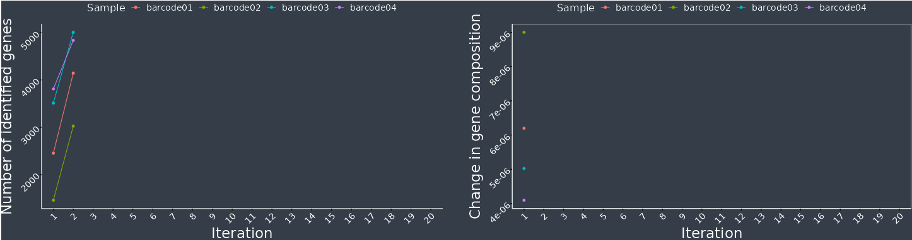
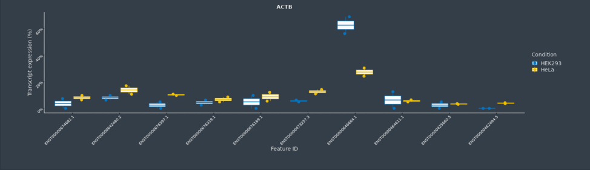

NanopoReaTA - Nanopore Real Time Analysis Pipeline
==================================================


[](https://www.nextflow.io/)
[](https://www.r-project.org/)
[](https://shiny.rstudio.com/)

**NanopoReaTA** is an R shiny application that integrates both preprocessing and downstream analysis pipelines for RNA sequencing data from Oxford Nanopore Technologies (ONT) into a user-friendly interface [1,2]. NanopoReaTA focuses on the analysis of (direct) cDNA and RNA-sequencing (cDNA, DRS) reads and guides you through the different steps up to final visualizations of results from i.e. differential expression or gene body coverage. Furthermore, NanopoReaTa can be run in real-time right after starting a run via MinKNOW, the sequencing application of ONT. 


**Currently available analysis modules:**
1. [Run Overview](#run-overview) - Experiment statistics over time
2. [Gene-wise analysis](#gene-wise-analysis) - Gene-wise analysis of expression (gene counts, gene body coverage)
3. [Differential expression analysis](#differential-expression-analysis) - Differential expression and/or usage analysis of genes (DGE) and transcripts (DTE + DTU)


# Installation
## Requirements
Hardware | Min. number
 :---: |  :---:
RAM | 64GB 
Threads | 12 
**Biological input** | 
Total number of samples | 4
Number of conditions | 2
Min. number of samples per condition | 2


## Installation using docker [2]
!IMPORTANT NOTE: All paths selected by NanopoReaTA should not contain any spaces in their names. Paths should always be named with underscores "_" instead of spaces " ". (e.g "Linux data" -> "Linux_data")!

#### Installation on Linux based systems

1. Open a bash shell Ctrl + Alt + T. 
2. Type the following command to install docker and pull the docker image:

```bash
sudo apt-get install -y docker.io
sudo docker pull stegiopast/nanoporeata:references
```
NOTE: With the docker image tag "references", all human and mouse reference files needed for NanopoReaTA will be automatically downloaded from GENCODE (~36 GB) and saved in root. If the root directory has limited space (< 40 GB), please use the tag "no_reference" as following and download the reference files as described below: 

```bash
sudo apt-get install -y docker.io
sudo docker pull stegiopast/nanoporeata:no_reference
```

3. Once the docker image is pulled, the container can be run with the following command:  

With references:
```bash
sudo docker run -it -p 8080:8080 -v /:/NanopoReaTA_linux_docker stegiopast/nanoporeata:references
```
Or without references: 
```bash
sudo docker run -it -p 8080:8080 -v /:/NanopoReaTA_linux_docker stegiopast/nanoporeata:no_reference
```

The docker container setup will be finished when the following line occurs:
```bash
Listening on http://0.0.0.0:8080
```

4. You can now navigate to a browser of your choice on your local machine and type in the following URL:
http://localhost:8080/

5. NanopoReaTA should now appear on the browser window. 

!NOTE: If a new docker version is available, please remove the previous docker image first, before pulling the new version of NanopoReaTA.! 

##### Remove NanopoReaTA docker image 

With references:
```bash
docker rmi -f stegiopast/nanoporeata:references
```


```bash
docker rmi -f stegiopast/nanoporeata:no_reference
```

#### Installation on Windows based systems

For a successfull usage on Windows sequencing output and output of NanopoReaTa have to be stored on the same hard-drive.

You will need one of the latest wsl systems on your computer.

1. Download docker desktop: https://www.docker.com/products/docker-desktop/

2. Start docker desktop application. In order to use docker applications on windows, docker desktop has to run in the background.  

3. Open power shell as administrator via search. (Start -> Search -> right click -> Open as administrator)

4. Update wsl:
```
wsl --update
```

5. Pull the docker image
```bash
docker pull stegiopast/nanoporeata:references
```

6. Start the docker image and mount the local system under a user-specified location; like "c:/". 
```
docker run -it -p 8080:8080 -v c:/:/NanopoReaTA_windows_docker stegiopast/nanoporeata:references
```
NOTE: With the docker image tag "references", all human and mouse reference files needed for NanopoReaTA will be automatically downloaded from GENCODE (~36 GB) and saved in root. If the root directory has limited space (< 40 GB), please use the tag "no_reference" as following and download the reference files as described below: 

```bash
docker pull stegiopast/nanoporeata:no_reference
docker run -it -p 8080:8080 -v c:/:/NanopoReaTA_windows_docker stegiopast/nanoporeata:no_reference
```

The docker container setup will be finished when the following line occurs:
Listening on http://0.0.0.0:8080

6. You can now navigate to a browser of your choice on your local machine and type in the following URL:
http://localhost:8080/

7. NanopoReaTA should now appear on the browser window. 

## Reference and annotation files

NOTE: If you pulled the docker image with included references, the data can be found in the "/Reference_data" folder of the docker. Mouse and Human data from GENCODE (https://www.gencodegenes.org) are included.

The required genome and annotation files for the organism of interest can be downloaded from the GENCODE database (https://www.gencodegenes.org/), since the syntax of NanopoReaTA is suited to the respective standards. Mouse reference data can be obtained at GENCODE database: GRCm39 Release M27 (https://www.gencodegenes.org/mouse/release_M27.html). Human reference data can be obtained at GENCODE database: GRCh38.primary_assembly v40 (https://www.gencodegenes.org/human/release_40.html). BED files of the respective genome versions can be downloaded from RSeQC: (https://sourceforge.net/projects/rseqc/files/BED).

The following files need to be downloaded:

 Functionality | Datatype | Comments 
 :---: | :---: | :---:
 Reference Genome | .fastq | Use primary assembly 
 Reference Transcriptome | .fastq | Use cdna files 
 GTF file | .gtf | Use the version that fits reference genome and transcriptome 
 BED file | .bed | BED files are available on (https://sourceforge.net/projects/rseqc/files/BED) 

## Usage
Before running/exploiting real experiments with NanopoReaTA, we highly recommend to test the app, first (see [Testing](#testing) for more information). NanopoReaTA operates with a backend preprocessing pipeline based on [nextflow](https://www.nextflow.io/) and multiple R and python based scripts for downstream analyses. All results are visualized within the [R shiny](https://shiny.rstudio.com/) based frontend.

### Welcome Page
When the application is started, the welcome page is shown and contains a **Start analysis** button as well as the [NanopoReaTA](#nanoporeata---nanopore-real-time-analysis-pipeline) manual. 

### Metadata Creator
After pushing the **Start NanopoReaTA** button the user is linked to a metadata creator page. If the user already created his or her own metadata file, he or her can skip this step and provide the path to the file in the configuation page. Please be aware of the format described below (tab-separated). If no metadata file is available, the user should enter the samples, conditions, and replicates of the running sequencing experiment and must then download the self-created metadata file. If samples are barcoded the samples must be named after their barcodes (barcode01-barcode96) - meaning the folder names that MinKNOW automatically creates must match. Once the self-created metadata is downloaded it can be locally renamed and moved. By clicking the blue arrow on the bottom right of the page the configuration of the processing can be initiated.  

#### Example metadata file

 Samples | Condition | Replicate | Custom 
 :---: | :---: | :---: | :---: 
 Sample1 | Cond1 | R1 | male
 Sample2 | Cond2 | R1 | female
 Sample3 | Cond1 | R1 | female
 Sample4 | Cond2 | R1 | male

### Configuration Page 
The user will be linked to the configuration page and has to select required files and folders or upload an already existing configuration file in yaml format from previous NanopoReaTA runs (Please check [example_conf_files](example_conf_files) for correct parameter naming). Under linux, the host system is mounted on */NanopoReaTA_linux_docker* and under windows it is mounted on */NanopoReaTA_windows_docker*. To locate files on your computer, you must navigate into the respective mount folder first.

The following parameters have to be set by the user: 
*Directory inputs needs an "/" at the end. Please make sure to let them end with an "/" character if manually written in the config.yaml file.

 Parameter | Datatype | Comments 
 :---: | :---: | :---:
 Number of threads | integer | Can be adjusted on the interactive scale bar 
 Run preprocessing | bool | Select yes or no (Yes if you want to run the Nextflow pipeline, no if your data is already preprocessed by NanopoReaTA)
 Barcoded | bool | Select yes or no (Yes if your dataset is multiplexed, no if it is not multiplexed)
 Path to main directory | string | Please insert the experiment directory created by MinKnow when the sequencing is started;
 Path to a metadata/description file  | string | Please insert the filepath to the created metadata file
 Path to Reference genome file  | string | Please insert the filepath to the reference genome - see below if docker "references" mode
 Path to Reference transcriptome file  | string | Please insert the filepath to the reference transcriptome
 GTF annotation file  | string | Please insert the filepath to the GTF file
 BED annotation file | string | Please insert the filepath to the BED file
 Output directory | string | Please insert the output directory file (Note that the ouput directory should already exist as an empty instance)

After all configurations are set, the configurations will be saved as config.yaml in the defined output folder. ("output directory") 

The selection can be confirmed by clicking the button at the bottom right of the tab **=>**. 

#### Sample settings
In this tab the metadata file is shown and the user can check whether all information are loaded correctly. For pairwise comparison, the user needs to select one of the columns containing two conditions that will be compared in further analyses. For visualizations, the user can change the color-coding for each condition here. The second selected condition will be used as reference/base level of the subsequent comparisons. 

By clicking on **Settings overview**, the user will be forwarded to the final [configuration overview](#settings-overview).
 
#### Settings overview
The input configurations can be finally checked by the user. If the parameters are correct, the user can start the preprocessing by clicking the **Start** button. Otherwise the user can rearrange the settings by going back to the configuration tab.


#### NanopoReaTA run options

1) Start  [NanopoReaTA's UI](#start-nanoporeata) and select *Run Preprocessing - Yes* at the [Configuration Page](#configuration-page) to start the backend preprocessing pipeline within the app. Press the "Start" button to initiate the preprocessing. One can keep track of the running nextflow pipeline within the index.log and error.log files created in the user-defined output folder by executing `tail -f /path/to/output/dir/index.log` in a terminal window. 

2) For visualization of NanopoReaTA preprocessed results only, start [NanopoReaTA's UI](#start-nanoporeata), select *Preprocessing - No* and set the respective output folder created by NanopoReaTA at the [Configuration Page](#configuration-page), before pressing the "Start" button. Preprocessing will not be executed.

### Run Overview
The Run Overview tab shows the number of reads and feature counts and visualizes the sample- and group-wise read length distribution and gene expression variability per preprocessing iteration. Additionally, the time each tool needs in each iteration is shown. All information is constantly updating when preprocessing is running.

#### Number of observations
The table in this tab shows the number of mapped genes (minimap2), gene counts (featureCounts) and transcriptome (salmon) counts. The counts are provided for each sample, respectively.

#### Read length distribution 
One can see the read length distributions for respective samples and conditions. The read length information is extracted directly from the fastq files (MinKNOW-defined passed reads only).

#### Gene expression variability

On the left side the number of genes detected is plotted per iteration for samples and selected conditions, respectively. The information is extracted from the output count table of FeatureCounts. 

On the right side the deviation of relative gene abundancy compared to the last iteration is plotted. This is a measure for the change of gene abundancy variability within a single sample. The latter allows an assumption whether relative abundancies have stabilized throughout the ongoing sequencing.  

<p align="center"></p>


#### Process time

This plot visualizes the run time for each tool running during the preprocessing. Thus, one is able to estimate the runtime for an update in the next iteration. Transcriptome and genome related steps run in parallel to optimize performance. All processing steps run in an additive manner to avoid redundant computational operations.  

<p align="center"></p>

### Preprocessing stop and go

For the following analytical steps the preprocessing should be temporarily stopped and the completion of the running iteration should be awaited. The stop preprocessing button on the left side causes the pipeline to stop after each completed preprocessing iteration. Subsequently, all the analytical steps of interest can be performed. The resume preprocessing button causes the pipeline to continue once all the analytical steps of interest are performed. Don't forget to "resume" it! ;) 


### Gene-wise analysis

In the Gene-wise anaylsis tab, one is able to explore the expression levels and the gene body coverage of particular genes of interest. Be aware that at least two samples per condition have to be considered in order to use this functionality.  


#### Gene counts

The table on the lefthand side lists all the genes annotated in the loaded GTF file. One can search and select several genes of interest via click on the table entry. Once a gene is selected it will occur on the table at the right hand side. By clicking the submit genes button, the analysis will start. A median of ratio normalization via DESeq2 will be performed and the user can plot the raw and normalized counts per condition as Dot-, Violin- or Boxplot.

<p align="center"></p>

#### Gene Body coverage

Here, one gene can be selected for gene body coverage analysis each time. The gene selection functions similar as in [Gene counts](#gene-counts). After the gene selection is submitted, the percentage of coverage for a gene divided into 100 percentiles is shown sample- and group-wise (=mean). The calculation is based on the RSeQC script for gene body coverage analysis (https://rseqc.sourceforge.net/).


### Differential Expression Analysis
In the Differential Expression Analysis tab, the user can run three different analyses: Differential Gene Expression (DGE), Differential Transcript Expression (DTE) and Differential Transcript Usage (DTU) by clicking the respective button. Note that these analyses do not update automatically when processing will be started again and new data is generated. That means that after stopping the preprocessing pipeline again, the analyses buttons need to be pressed to analyse latest input files (like counts files). Once the analysis is completed, the user will be linked to the respective analysis output tab (may take a few minutes). 

#### Gene-level analysis (DGE with DESeq2)
Differential gene expression analysis will be performed and the following visualizations are shown:
- A table of all differentially expressed genes
- PCA analysis
- Volcano plot (DGE)
- Sample-2-Sample plot
- Heatmap of the top 20 differentially expressed genes based on p-adjusted

<p align="center"></p>
<p align="center"></p>

#### Transcript-level analysis
##### Differential Transcript Expression (DTE with DESeq2)
Differential transcript expression analysis will be performed and the following visualizations are shown:
- A table of all differentially expressed transcripts
- PCA analysis
- Volcano plot (DTE)
- Sample-2-Sample plot
- Heatmap of the top 20 differentially expressed transcripts based on p-adjusted

<p align="center"></p>

##### Differential Transcript Usage (DTU with DRIMSeq and DEXSeq)
Differential transcript usage analysis will be performed with DEXSeq and DRIMSeq.
The following visualizations are shown: 
- Tables of all differentially used transcripts' analysis results (Results of DEXSeq and DRIMSeq)
- General: To allow a general DTU overview, the log2FoldChange values from DEXSeq are plotted against the adjusted p-value (Volcano plot)
- Gene specific: One can select a gene to show the transcripts abundances within a gene of interest as boxplots per condition based on DRIMSeq's output.

<p align="center"></p>


### Test data
We provide a dataset of cDNA extracted from 2 samples of HEK293 and 2 samples of HeLa cells. The cells have been incubated for ~5 days in 95% humidity with a 5% C02 concentration in. When cells reached 90% confluency the RNA was isolated with Trizol and treated with DNase I. Reverse transcription and library preparation was performed with ONT (Oxford Nanopore Technologies) based direct cDNA kit + native barcoding expansion kit (SQK-DCS109 + EXP-NBD104).

Test data is available on the ENA (European Nucleotide Archive) with the project number PRJEB61670: https://www.ebi.ac.uk/ena/browser/view/PRJEB61670.
Please note that one will have to reconstruct the folder structure of the MinKnow output using barcoded samples.

Experiment_folder/Sample_folder/Identifier/fastq_pass/barcodeXY/*.fastq with (barcode01-barcode04). Barcode01 + barcode02 are HEK293 cDNA samples and barcode03-04 are HeLa cDNA samples.  

The metadata file can be found under https://github.com/AnWiercze/NanopoReaTA/blob/master/example_conf_files/example_metadata.txt.


## Publications

A pre-print of this tool is published on bioRXiv:

Anna Wierczeiko, Stefan Pastore, Stefan Mündnich, Mark Helm, Tamer Butto, Susanne Gerber (2022). NanopoReaTA: a user-friendly tool for nanopore-seq real-time transcriptional analysis. bioRxiv 2022.12.13.520220; doi: https://doi.org/10.1101/2022.12.13.520220 


## References

[1] Amarasinghe, S. L., Su, S., Dong, X., Zappia, L., Ritchie, M. E., & Gouil, Q. (2020). Opportunities and challenges in long-read sequencing data analysis. Genome Biology 2020 21:1, 21(1), 1–16. https://doi.org/10.1186/S13059-020-1935-5
[2] Chang W, Cheng J, Allaire J, Sievert C, Schloerke B, Xie Y, Allen J, McPherson J, Dipert A, Borges B (2023). shiny: Web Application Framework for R. R package version 1.7.4.9002, https://shiny.rstudio.com/

[3] Di Tommaso, P., Chatzou, M., Floden, E. W., Barja, P. P., Palumbo, E., & Notredame, C. (2017). Nextflow enables reproducible computational workflows. Nature Biotechnology, 35(4), 316–319. doi:10.1038/nbt.3820

[4] Anders, S., Reyes, A., & Huber, W. (2012). Detecting differential usage of exons from RNA-seq data. Genome Research, 22(10), 2008–2017. https://doi.org/10.1101/GR.133744.111

[5] Li, H. (2018). Minimap2: pairwise alignment for nucleotide sequences. Bioinformatics, 34(18), 3094–3100. https://doi.org/10.1093/BIOINFORMATICS/BTY191

[6] Liao, Y., Smyth, G. K., & Shi, W. (2014). featureCounts: an efficient general purpose program for assigning sequence reads to genomic features. Bioinformatics, 30(7), 923–930. https://doi.org/10.1093/BIOINFORMATICS/BTT656

[7] Love, M. I., Huber, W., & Anders, S. (2014). Moderated estimation of fold change and dispersion for RNA-seq data with DESeq2. Genome Biology, 15(12), 1–21. https://doi.org/10.1186/S13059-014-0550-8/FIGURES/9

[8] Merkel, D., 2014. Docker: lightweight linux containers for consistent development and deployment. Linux journal, 2014(239), p.2 http://dx.doi.org/10.4236/jsea.2011.46043

[9] Munro, R., Santos, R., Payne, A., Forey, T., Osei, S., Holmes, N., & Loose, M. (2022). minoTour, real-time monitoring and analysis for nanopore sequencers. Bioinformatics, 38(4), 1133–1135. https://doi.org/10.1093/BIOINFORMATICS/BTAB780

[10] Nowicka M, Robinson MD (2016). “DRIMSeq: a Dirichlet-multinomial framework for multivariate count outcomes in genomics [version 2; referees: 2 approved].” F1000Research, 5(1356). doi: 10.12688/f1000research.8900.2, https://f1000research.com/articles/5-1356/v2. 

[11] Reyes A, Anders S, Weatheritt R, Gibson T, Steinmetz L, Huber W (2013). “Drift and conservation of differential exon usage across tissues in primate species.” PNAS, 110, -5. doi: 10.1073/pnas.1307202110. 

[12] Patro, R., Duggal, G., Love, M. I., Irizarry, R. A., & Kingsford, C. (2017). Salmon provides fast and bias-aware quantification of transcript expression. Nature Methods 2017 14:4, 14(4), 417–419. https://doi.org/10.1038/nmeth.4197

[13] Wang, L., Wang, S., & Li, W. (2012). RSeQC: quality control of RNA-seq experiments. Bioinformatics, 28(16), 2184–2185. https://doi.org/10.1093/BIOINFORMATICS/BTS356

[14] Wang, Y., Zhao, Y., Bollas, A., Wang, Y., & Au, K. F. (2021). Nanopore sequencing technology, bioinformatics and applications. Nature Biotechnology 2021 39:11, 39(11), 1348–1365. https://doi.org/10.1038/s41587-021-01108-x


## Contact

Please open an [issue](https://github.com/AnWiercze/NanopoReaTA/issues) if you encounter any issues/troubles. 
However, please go over the previous issues (including closed issues) before opening a new issue, as your same exact question might have been already answered previously. Thank you!
